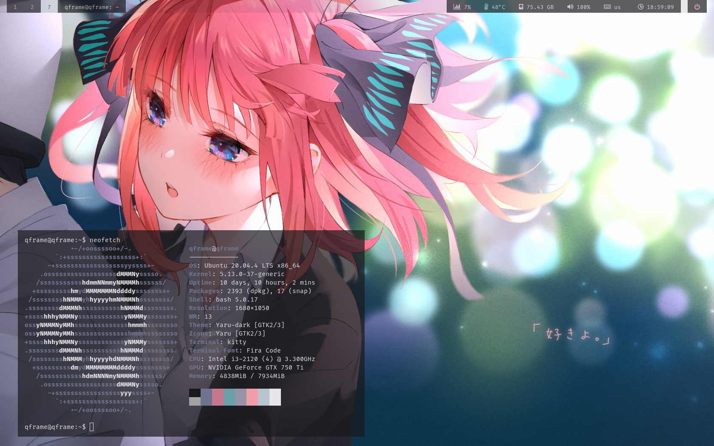
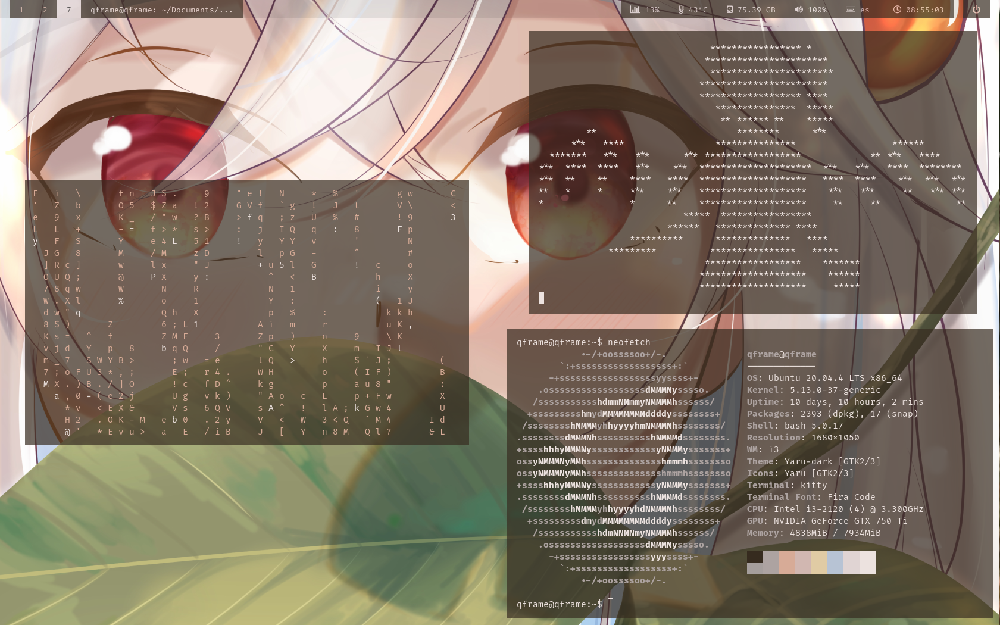
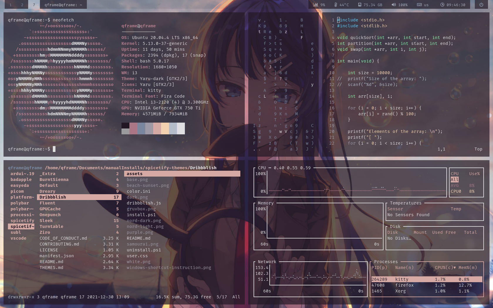

# My Dotfiles

This is my personal repo for my .config files. It is mostly a basic template which can be further configured and personalized. It uses what I mostly consider essential programs to get everything running and also have a fairly aesthetic desktop.

These dotfiles are based off the following repositories:

- [@melorin4 dotfles](https://github.com/melorin4/dotfiles)
- [@nothingButSyntaxError dotfiles](https://github.com/nothingButSyntaxError/dotfiles)

## Dependencies
- [i3-gaps](https://github.com/Airblader/i3): fork of the i3 window manager.
- [picom (ibhagwan fork)](https://github.com/ibhagwan/picom): lightweight compositor for X11 (similar to compton).
- [dunst](https://github.com/dunst-project/dunst): lightweight and customizable notification daemon.
- [kitty](https://github.com/kovidgoyal/kitty): terminal emulator.
- [rofi](https://github.com/davatorium/rofi): app launcher, dmenu replacement.
- [feh](https://github.com/derf/feh): image viewer and wallpaper manager.
- [pywal](https://github.com/dylanaraps/pywal): color palette/theme generator based on desktop wallpaper.
- [flameshot](https://github.com/flameshot-org/flameshot): screenshot software.
- [vim](https://github.com/vim/vim): text editor.
- [polybar](https://github.com/polybar/polybar): customizable status bar replacement for i3bar (the themes inside the polybar config folder come from [polybar-themes](https://github.com/adi1090x/polybar-themes) by [@adi1090x](https://github.com/adi1090x). I just modified the `colorblocks` theme).

### Fonts
- [Fira Code](https://github.com/tonsky/FiraCode) (great to code with).
- [Iosevka Nerd Font](https://github.com/ryanoasis/nerd-fonts/tree/master/patched-fonts/Iosevka) (handles the icons).

## Installation
Clone this repo to your `~/.config` folder and make sure you install/build correctly all the dependencies AND are added to your $PATH. The `.bashrc` file has some examples on how to do this.

The `.vimrc` and `.bashrc` files should be placed in your $HOME directory (also known as `~`).

The wallpapers used in the demos are in the directory called `wallpapers`. NOTE: in the `i3/config` file, `feh` is being executed and given an image which is located at `~/Pictures/wallpapers/`. If you want this to work you should place the `wallpapers` directory under `~/Pictures/` or change the path in the i3 `config` file.
